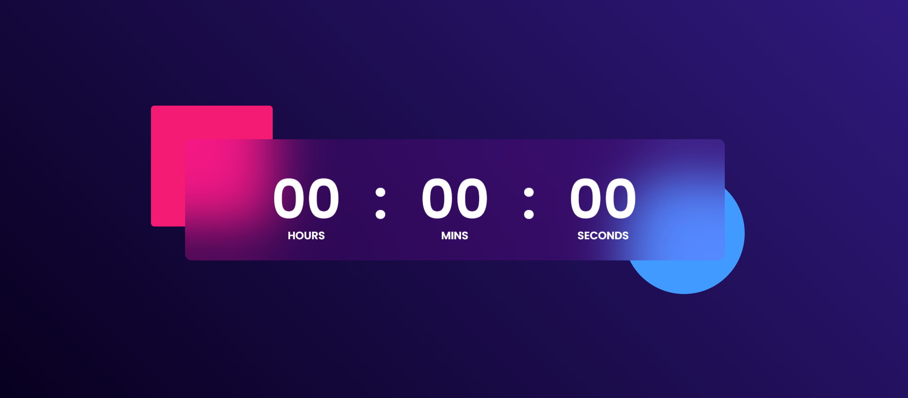

# ⏰ Digital Clock

This is a **Digital Clock** built using **HTML**, **CSS**, and **JavaScript**.  
It displays the **current time** in hours, minutes, and seconds format, and updates live every second..

## 🛠️ Features
- Real-time clock display
- 24-hour format
- Zero-padded digits (e.g., `09:03:07`)
- Responsive and centered layout
- Clean UI using simple CSS

## 📷 Screenshot


## 📁 Files
- `index.html`: Main HTML structure
- `styles.css`: Styling for the clock layout
- `Img.png`: Screenshot of the project
- `README.md`: Project description

## 🚀 How to Run
1. Download or clone the repository.
2. Open `index.html` in your browser.
3. Watch the time tick live! ⏳

---

## 🧠 JavaScript Logic (Quick Overview)
The script fetches the current time every second using `setInterval()` and updates the DOM with formatted hour, minute, and second values using `Date()`.

```js
setInterval(() => {
    let currtime = new Date(); // Fixed typo from 'Dae' to 'Date'

    hrs.innerHTML = (currtime.getHours() < 10 ? "0" : "") + currtime.getHours();
    min.innerHTML = (currtime.getMinutes() < 10 ? "0" : "") + currtime.getMinutes();
    sec.innerHTML = (currtime.getSeconds() < 10 ? "0" : "") + currtime.getSeconds();
}, 1000);
