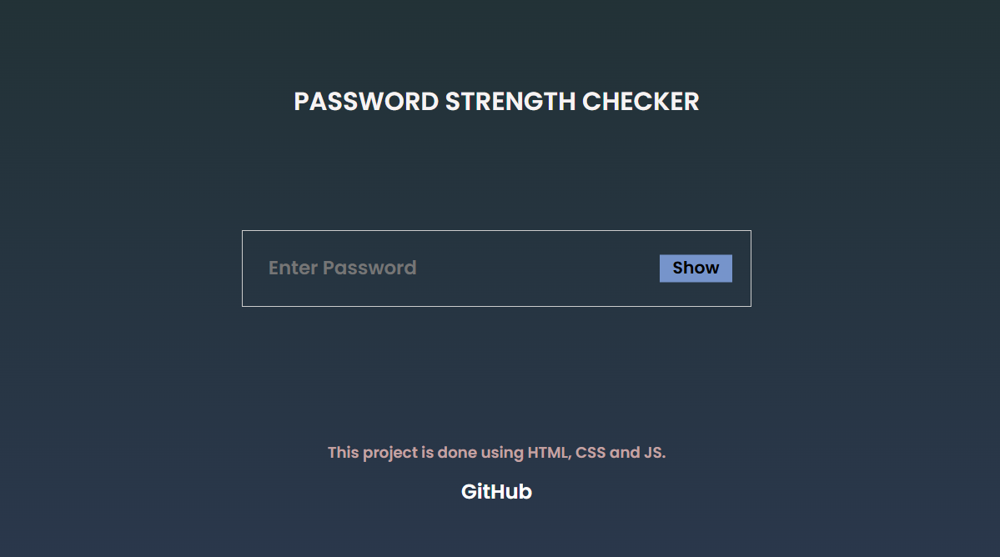
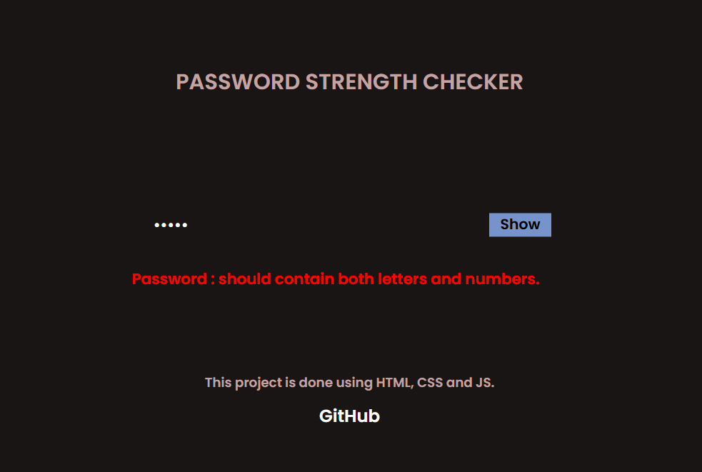
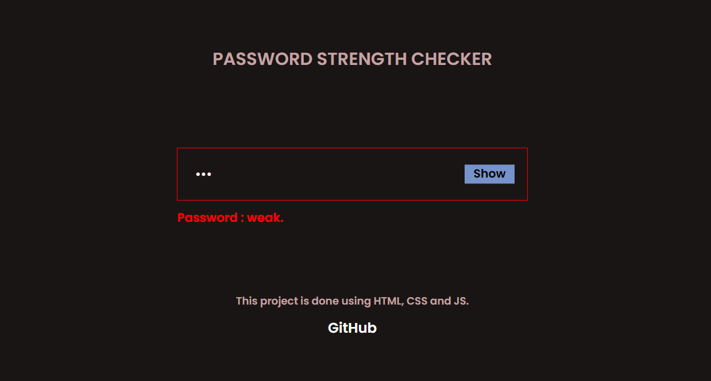
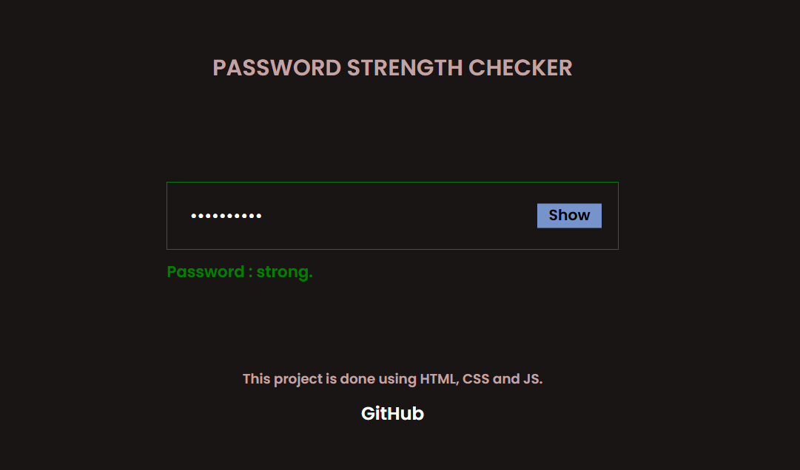

# 🔐 Password Strength Checker

A simple **Password Strength Checker** built using **HTML**, **CSS**, and **JavaScript**.  
It provides real-time feedback on password strength based on various security rules, with a clean and user-friendly UI.


## 🛠️ Tech Stack

- **HTML** — Structure of the app  
- **CSS** — Styling for layout and indicators  
- **JavaScript** — Password validation logic and interactivity

---

---

## 🚀 Features

✅ Real-time password strength evaluation  
✅ Checks for:
- At least one **uppercase letter**
- At least one **lowercase letter**
- At least one **number**
- At least one **special character** (e.g. `@`, `#`, `$`, etc.)
- Minimum length requirement (optional)

✅ Visual indicator of strength (e.g. weak, moderate, strong)  
✅ Option to **show/hide password** using a toggle  
✅ Built with a **clean and responsive UI**

---
## 📸 Preview

  

  

  

  

  

---

## 🧪 How to Use

1. Clone the repository:
   ```bash
   git clone https://github.com/Suryaatejk/JS-Projects/PasswordStrength.git
