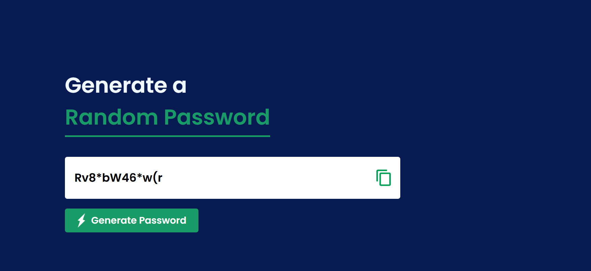

# JavaScript Projects

Welcome to the JavaScript Projects Repository! 🚀  
This collection is a showcase of various beginner-to-advanced projects built using **HTML**, **CSS**, and **JavaScript**.

## 🔢 Projects Included

### 1. Digital Clock ⏰
A simple, real-time digital clock that displays the current time in hours, minutes, and seconds using JavaScript. The clock updates every second and has a clean UI styled with CSS.

***

### 2. [Random Password Generator 🔐]
A secure password generator that creates a random 12-character password including uppercase, lowercase, digits, and special characters.

Stay tuned for more projects!

