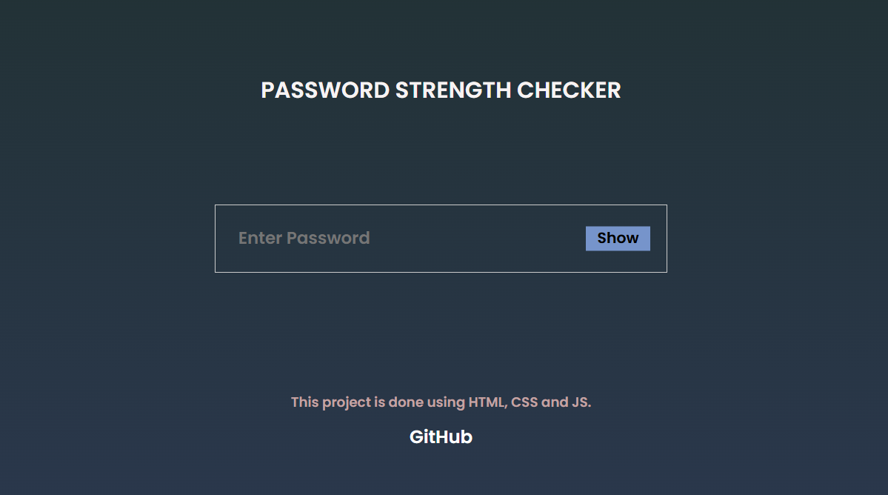

# JavaScript Projects

Welcome to the JavaScript Projects Repository! 🚀  
This collection is a showcase of various beginner-to-advanced projects built using **HTML**, **CSS**, and **JavaScript**.

---

## 🔢 Projects Included

### 1. Digital Clock ⏰  
A simple, real-time digital clock that displays the current time in hours, minutes, and seconds using JavaScript. The clock updates every second and has a clean UI styled with CSS.

---

### 2. Random Password Generator 🔐 
A secure password generator that creates a random 12-character password including uppercase, lowercase, digits, and special characters.

---

### 3. Password Strength Checker 🔒  
A real-time password strength checker that evaluates passwords based on the following rules:
- Includes at least one **uppercase letter**
- Includes at least one **lowercase letter**
- Includes at least one **digit**
- Includes at least one **special character** (e.g. `@`, `#`, `$`, etc.)
- Option to **show/hide** password
- User-friendly interface to test password strength.

 <!-- Replace with actual screenshot path -->

---

Stay tuned for more projects!

---
